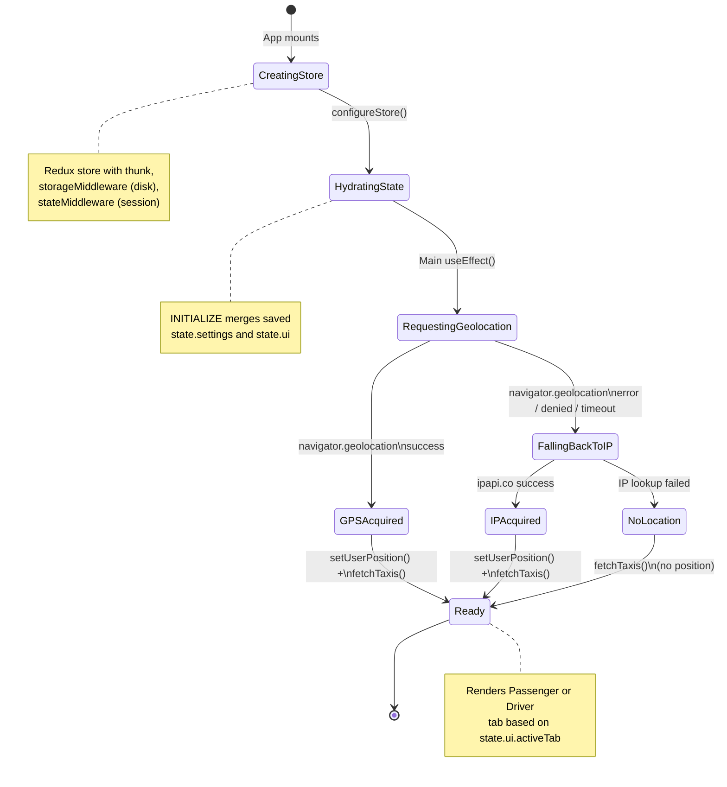
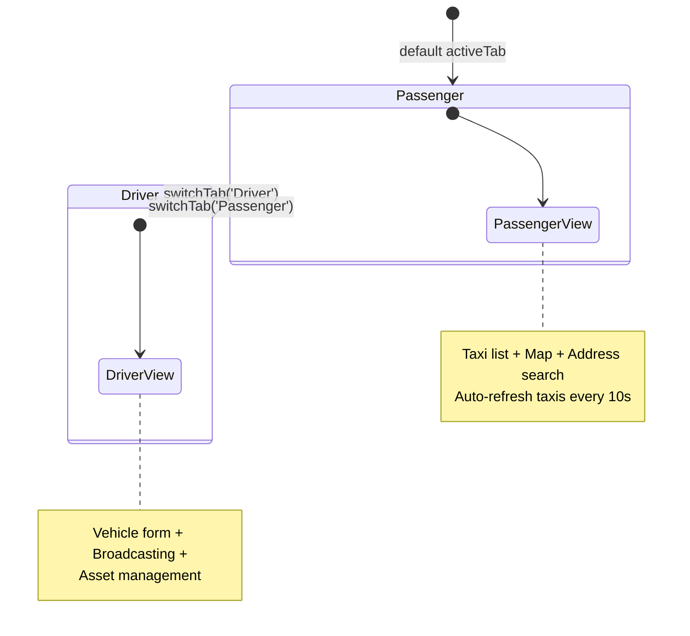
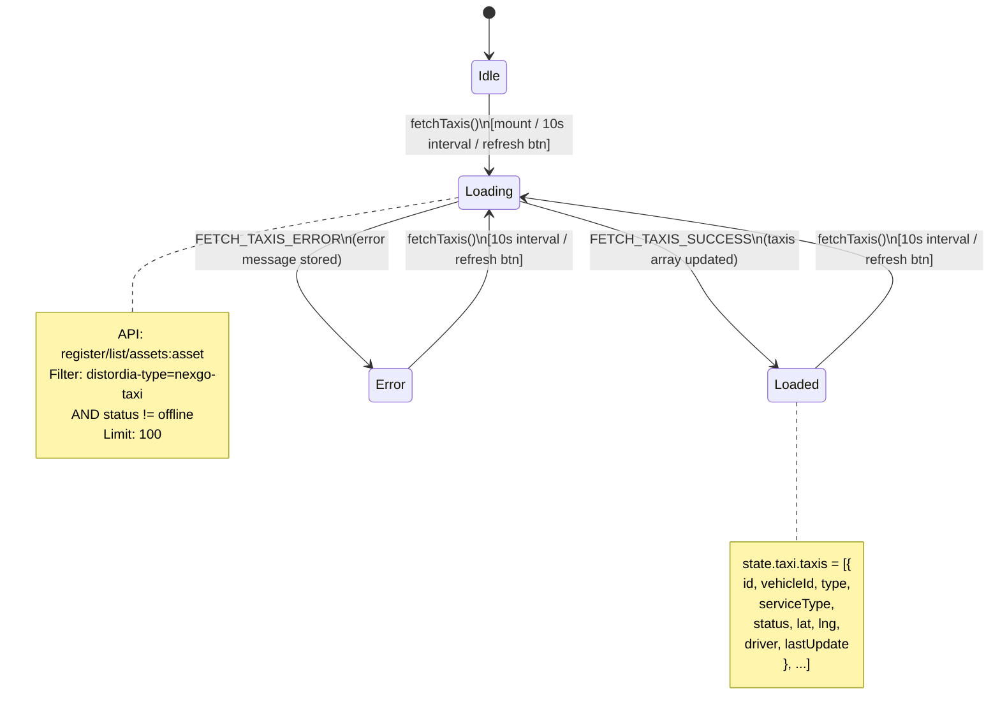
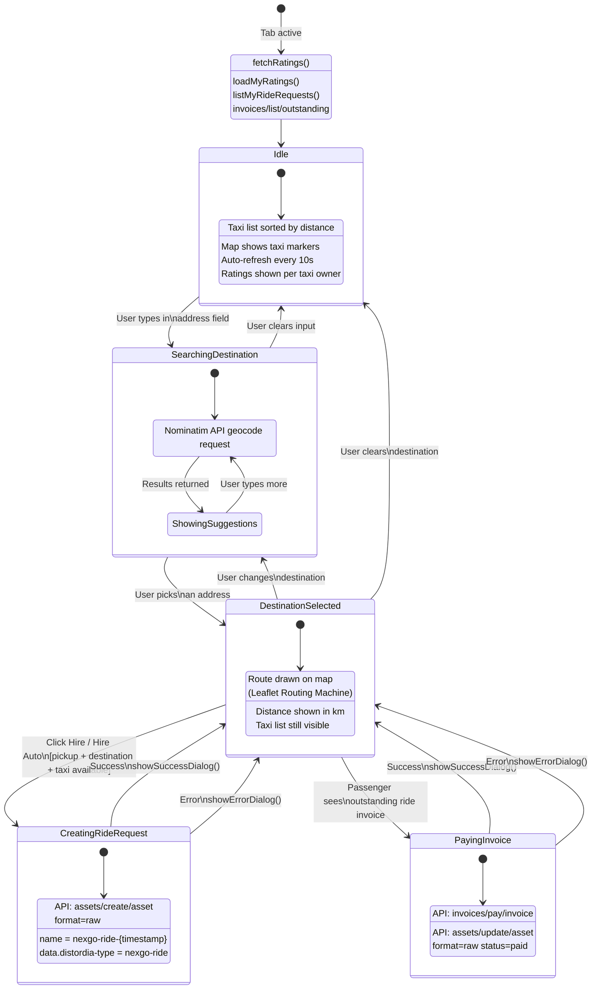
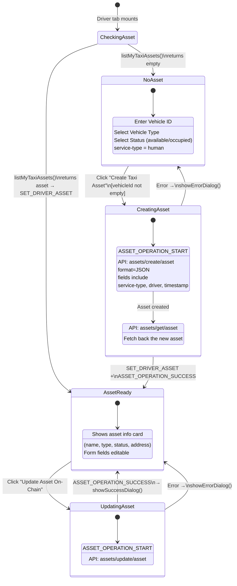
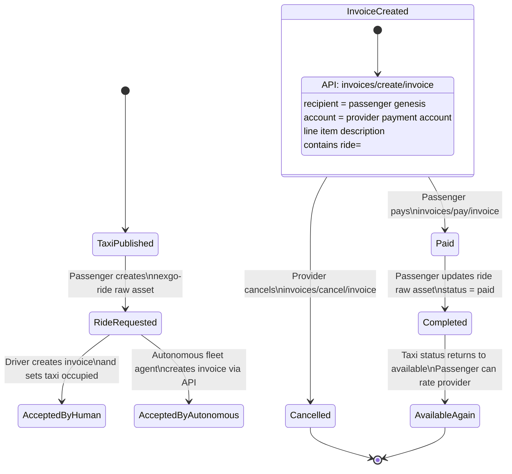
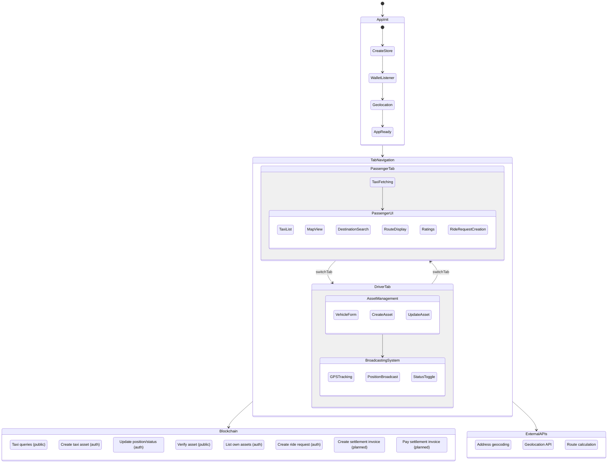
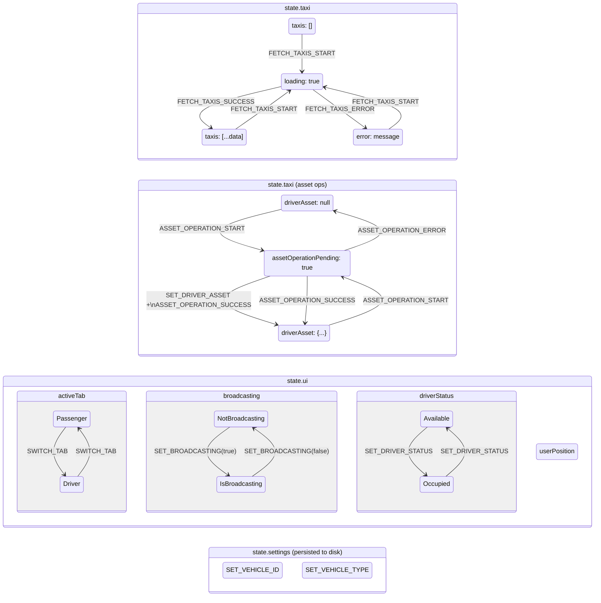

# NexGo State Machines

State machine diagrams for every major flow in the NexGo app.

---

## 1. App Initialization

```mermaid
stateDiagram-v2
    [*] --> CreatingStore : App mounts
    CreatingStore --> HydratingState : configureStore()
    HydratingState --> RequestingGeolocation : Main useEffect()
    RequestingGeolocation --> GPSAcquired : navigator.geolocation\nsuccess
    RequestingGeolocation --> FallingBackToIP : navigator.geolocation\nerror / denied / timeout
    FallingBackToIP --> IPAcquired : ipapi.co success
    FallingBackToIP --> NoLocation : IP lookup failed

    GPSAcquired --> Ready : setUserPosition() +\nfetchTaxis()
    IPAcquired --> Ready : setUserPosition() +\nfetchTaxis()
    NoLocation --> Ready : fetchTaxis()\n(no position)

    Ready --> [*]

    note right of CreatingStore
        Redux store with thunk,
        storageMiddleware (disk),
        stateMiddleware (session)
    end note

    note right of HydratingState
        INITIALIZE merges saved
        state.settings and state.ui
    end note

    note right of Ready
        Renders Passenger or Driver
        tab based on state.ui.activeTab
    end note
```

---

## 2. Tab Navigation

```mermaid
stateDiagram-v2
    [*] --> Passenger : default activeTab

    Passenger --> Driver : switchTab('Driver')
    Driver --> Passenger : switchTab('Passenger')

    state Passenger {
        [*] --> PassengerView
        note right of PassengerView
            Taxi list + Map + Address search
            Auto-refresh taxis every 10s
        end note
    }

    state Driver {
        [*] --> DriverView
        note right of DriverView
            Vehicle form + Broadcasting +
            Asset management
        end note
    }
```

---

## 3. Taxi Fetching

Shared sub-flow used by the Passenger tab (initial mount, auto-refresh every 10s, and manual refresh).

```mermaid
stateDiagram-v2
    [*] --> Idle

    Idle --> Loading : fetchTaxis()\n[mount / 10s interval / refresh btn]
    Loading --> Loaded : FETCH_TAXIS_SUCCESS\n(taxis array updated)
    Loading --> Error : FETCH_TAXIS_ERROR\n(error message stored)

    Loaded --> Loading : fetchTaxis()\n[10s interval / refresh btn]
    Error --> Loading : fetchTaxis()\n[10s interval / refresh btn]

    note right of Loading
        API: register/list/assets:asset
        Filter: distordia-type=nexgo-taxi
                AND status != offline
        Limit: 100
    end note

    note right of Loaded
        state.taxi.taxis = [{
          id, vehicleId, type,
          serviceType,
          status, lat, lng,
          driver, lastUpdate
        }, ...]
    end note
```

---

## 4. Passenger Flow

```mermaid
stateDiagram-v2
    [*] --> LoadingPassengerData : Tab active
    LoadingPassengerData : fetchRatings()
    LoadingPassengerData : loadMyRatings()
    LoadingPassengerData : listMyRideRequests()
    LoadingPassengerData : invoices/list/outstanding
    LoadingPassengerData --> Idle

    state Idle {
        [*] --> ViewingTaxiList
        ViewingTaxiList : Taxi list sorted by distance
        ViewingTaxiList : Map shows taxi markers
        ViewingTaxiList : Auto-refresh every 10s
        ViewingTaxiList : Ratings shown per taxi owner
    }

    Idle --> SearchingDestination : User types in\naddress field

    state SearchingDestination {
        [*] --> Querying
        Querying : Nominatim API geocode request
        Querying --> ShowingSuggestions : Results returned
        ShowingSuggestions --> Querying : User types more
    }

    SearchingDestination --> Idle : User clears input
    SearchingDestination --> DestinationSelected : User picks\nan address

    state DestinationSelected {
        [*] --> ViewingRoute
        ViewingRoute : Route drawn on map\n(Leaflet Routing Machine)
        ViewingRoute : Distance shown in km
        ViewingRoute : Taxi list still visible
    }

    DestinationSelected --> CreatingRideRequest : Click Hire / Hire Auto\n[pickup + destination + taxi available]

    state CreatingRideRequest {
        [*] --> SubmittingRide
        SubmittingRide : API: assets/create/asset\nformat=raw
        SubmittingRide : name = nexgo-ride-{timestamp}
        SubmittingRide : data.distordia-type = nexgo-ride
    }

    CreatingRideRequest --> DestinationSelected : Success\nshowSuccessDialog()
    CreatingRideRequest --> DestinationSelected : Error\nshowErrorDialog()

    DestinationSelected --> PayingInvoice : Passenger sees\noutstanding ride invoice

    state PayingInvoice {
        [*] --> Paying
        Paying : API: invoices/pay/invoice
        Paying : API: assets/update/asset\nformat=raw status=paid
    }

    PayingInvoice --> DestinationSelected : Success\nshowSuccessDialog()
    PayingInvoice --> DestinationSelected : Error\nshowErrorDialog()

    DestinationSelected --> SearchingDestination : User changes\ndestination
    DestinationSelected --> Idle : User clears\ndestination
```

---

## 5. Driver Asset Management

This flow is for human-operated taxis created inside the module. Autonomous taxis can skip the UI and create/update the same `nexgo-taxi` asset standard directly via the Nexus API.

```mermaid
stateDiagram-v2
    [*] --> CheckingAsset : Driver tab mounts

    CheckingAsset --> NoAsset : listMyTaxiAssets()\nreturns empty
    CheckingAsset --> AssetReady : listMyTaxiAssets()\nreturns asset → SET_DRIVER_ASSET

    state NoAsset {
        [*] --> EditingForm
        EditingForm : Enter Vehicle ID
        EditingForm : Select Vehicle Type
        EditingForm : Select Status (available/occupied)
        EditingForm : service-type = human
    }

    NoAsset --> CreatingAsset : Click "Create Taxi Asset"\n[vehicleId not empty]

    state CreatingAsset {
        [*] --> Pending
        Pending : ASSET_OPERATION_START
        Pending : API: assets/create/asset
        Pending : format=JSON
        Pending : fields include\nservice-type, driver, timestamp
        Pending --> Verifying : Asset created
        Verifying : API: assets/get/asset
        Verifying : Fetch back the new asset
    }

    CreatingAsset --> AssetReady : SET_DRIVER_ASSET +\nASSET_OPERATION_SUCCESS
    CreatingAsset --> NoAsset : Error →\nshowErrorDialog()

    state AssetReady {
        [*] --> AssetIdle
        AssetIdle : Shows asset info card
        AssetIdle : (name, type, status, address)
        AssetIdle : Form fields editable
    }

    AssetReady --> UpdatingAsset : Click "Update Asset On-Chain"

    state UpdatingAsset {
        [*] --> Saving
        Saving : ASSET_OPERATION_START
        Saving : API: assets/update/asset
    }

    UpdatingAsset --> AssetReady : ASSET_OPERATION_SUCCESS\n→ showSuccessDialog()
    UpdatingAsset --> AssetReady : Error →\nshowErrorDialog()
```

---

## 6. Driver Broadcasting

```mermaid
stateDiagram-v2
    [*] --> Idle : Broadcasting = false

    state Idle {
        [*] --> Ready
        Ready : Form editable
        Ready : No GPS watch active
        Ready : No position updates sent
    }

    Idle --> StartingBroadcast : Click "Start Broadcasting"\n[vehicleId not empty, GPS available]

    state StartingBroadcast {
        [*] --> ValidateState
        ValidateState --> Blocked : No vehicleId / no position / no asset
        ValidateState --> PushInitialUpdate : Ready to publish
        PushInitialUpdate : API: assets/update/asset\n(status, lat, lng, timestamp)
        PushInitialUpdate --> ActivateBroadcast : Update succeeded
        ActivateBroadcast : setBroadcasting(true)
    }

    StartingBroadcast --> Idle : Error\nshowErrorDialog()
    StartingBroadcast --> Broadcasting : Broadcasting activated

    state Broadcasting {
        [*] --> Active
        Active : GPS watchPosition() running\n(high accuracy)
        Active : Redux userPosition updated locally
        Active : Form fields disabled

        state Active {
            [*] --> WaitingForManualPush
            WaitingForManualPush --> SendingUpdate : Click "Update Location On-Chain"
            SendingUpdate : API: assets/update/asset\n(lat, lng, status, vehicle-type, timestamp)
            SendingUpdate --> WaitingForManualPush : Success / Error dialog
        }
    }

    Broadcasting --> StatusChange : Toggle Available / Occupied
    StatusChange --> Broadcasting : setDriverStatus()\n(next on-chain push uses new status)

    Broadcasting --> StoppingBroadcast : Click "Stop Broadcasting"

    state StoppingBroadcast {
        [*] --> Deactivating
        Deactivating : setBroadcasting(false)
        Deactivating : Clear GPS watch
        Deactivating --> SettingOffline : Update asset\nstatus = 'offline'
        SettingOffline : API: assets/update/asset
    }

    StoppingBroadcast --> Idle : Done\n(silent error handling)

    state Blocked {
        [*] --> WaitingForInput
    }
```

---

## 7. Decentralized Hire + Settlement Flow

This is the implemented decentralized service flow aligned with the Nexus Assets and Invoices APIs. Because the ride request raw asset is owned by the passenger, provider acceptance is represented by invoice issuance plus the provider setting the taxi status to `occupied`.

```mermaid
stateDiagram-v2
    [*] --> TaxiPublished

    TaxiPublished --> RideRequested : Passenger creates\nnexgo-ride raw asset
    RideRequested --> AcceptedByHuman : Driver creates invoice\nand sets taxi occupied
    RideRequested --> AcceptedByAutonomous : Autonomous fleet agent\ncreates invoice via API

    state InvoiceCreated {
        [*] --> Outstanding
        Outstanding : API: invoices/create/invoice
        Outstanding : recipient = passenger genesis
        Outstanding : account = provider payment account
        Outstanding : line item description\ncontains ride=<ride-address>
    }

    InvoiceCreated --> Paid : Passenger pays\ninvoices/pay/invoice
    InvoiceCreated --> Cancelled : Provider cancels\ninvoices/cancel/invoice
    Paid --> Completed : Passenger updates ride raw asset\nstatus = paid
    Completed --> AvailableAgain : Taxi status returns to available\nPassenger can rate provider
    Cancelled --> [*]
    AvailableAgain --> [*]
```

---

## 8. Full System Overview

```mermaid
stateDiagram-v2
    [*] --> AppInit

    state AppInit {
        [*] --> CreateStore
        CreateStore --> WalletListener
        WalletListener --> Geolocation
        Geolocation --> AppReady
    }

    AppInit --> TabNavigation

    state TabNavigation {
        state PassengerTab {
            TaxiFetching --> PassengerUI
            state PassengerUI {
                TaxiList
                MapView
                DestinationSearch
                RouteDisplay
                Ratings
                RideRequestCreation
            }
        }

        state DriverTab {
            AssetManagement --> BroadcastingSystem
            state AssetManagement {
                VehicleForm
                CreateAsset
                UpdateAsset
            }
            state BroadcastingSystem {
                GPSTracking
                PositionBroadcast
                StatusToggle
            }
        }

        PassengerTab --> DriverTab : switchTab
        DriverTab --> PassengerTab : switchTab
    }

    state Blockchain {
        RegisterListAssets : Taxi queries (public)
        AssetsCreate : Create taxi asset (auth)
        AssetsUpdate : Update position/status (auth)
        AssetsGet : Verify asset (public)
        AssetsList : List own assets (auth)
        AssetsCreateRaw : Create ride request (auth)
        InvoicesCreate : Create settlement invoice (planned)
        InvoicesPay : Pay settlement invoice (planned)
    }

    state ExternalAPIs {
        Nominatim : Address geocoding
        BrowserGPS : Geolocation API
        LeafletRouting : Route calculation
    }

    TabNavigation --> Blockchain
    TabNavigation --> ExternalAPIs
```

---

## Redux State Transitions

```mermaid
stateDiagram-v2
    direction LR

    state "state.taxi" as taxi {
        state "taxis: []" as taxis_empty
        state "loading: true" as loading
        state "taxis: [...data]" as taxis_loaded
        state "error: message" as error

        taxis_empty --> loading : FETCH_TAXIS_START
        taxis_loaded --> loading : FETCH_TAXIS_START
        error --> loading : FETCH_TAXIS_START
        loading --> taxis_loaded : FETCH_TAXIS_SUCCESS
        loading --> error : FETCH_TAXIS_ERROR
    }

    state "state.taxi (asset ops)" as assetOps {
        state "driverAsset: null" as no_asset
        state "assetOperationPending: true" as op_pending
        state "driverAsset: {...}" as has_asset

        no_asset --> op_pending : ASSET_OPERATION_START
        op_pending --> has_asset : SET_DRIVER_ASSET +\nASSET_OPERATION_SUCCESS
        op_pending --> no_asset : ASSET_OPERATION_ERROR
        has_asset --> op_pending : ASSET_OPERATION_START
        op_pending --> has_asset : ASSET_OPERATION_SUCCESS
    }

    state "state.ui" as ui {
        state "activeTab" as tab
        state "broadcasting" as bc
        state "driverStatus" as ds
        state "userPosition" as pos

        state tab {
            Passenger --> Driver : SWITCH_TAB
            Driver --> Passenger : SWITCH_TAB
        }
        state bc {
            NotBroadcasting --> IsBroadcasting : SET_BROADCASTING(true)
            IsBroadcasting --> NotBroadcasting : SET_BROADCASTING(false)
        }
        state ds {
            Available --> Occupied : SET_DRIVER_STATUS
            Occupied --> Available : SET_DRIVER_STATUS
        }
    }

    state "state.settings (persisted to disk)" as settings {
        VehicleId : SET_VEHICLE_ID
        VehicleType : SET_VEHICLE_TYPE
    }
```
