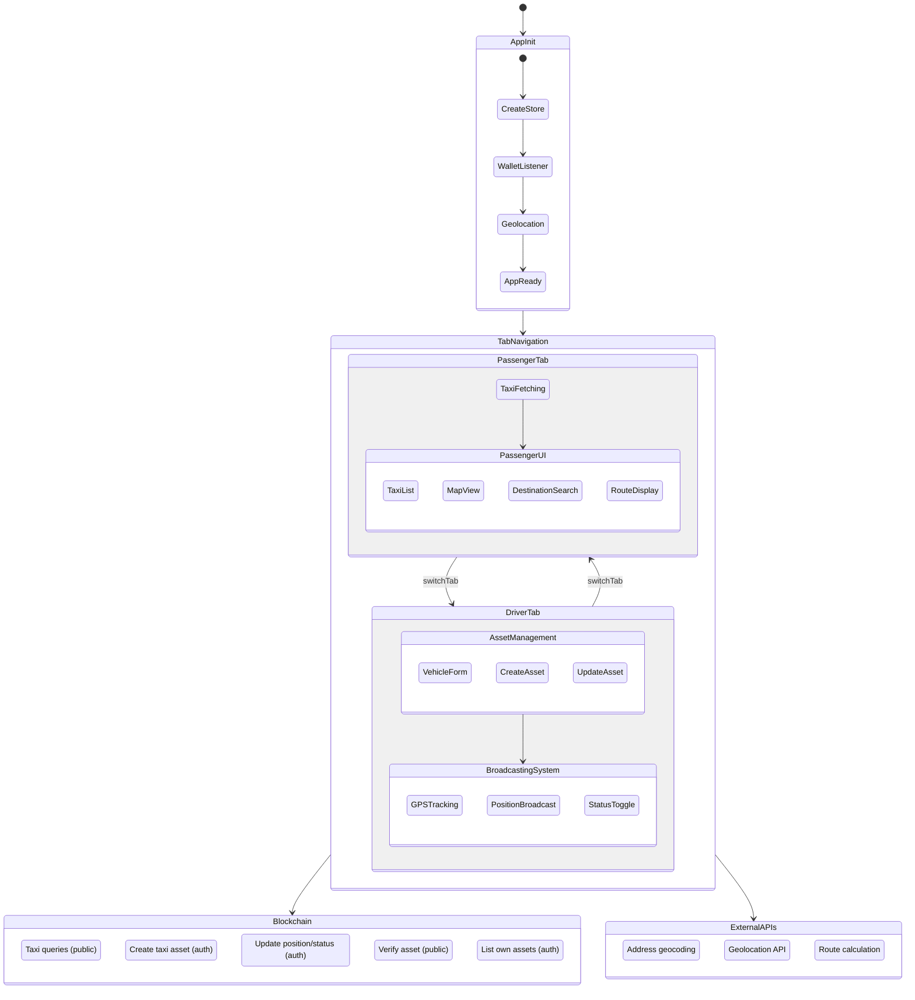

# NexGo State Machines

State machine diagrams for every major flow in the NexGo app.

---

## 1. App Initialization


---

## 2. Tab Navigation


---

## 3. Taxi Fetching

Shared sub-flow used by the Passenger tab (auto-refresh every 10s, manual refresh, and initial mount).


---

## 4. Passenger Flow


---

## 5. Driver Asset Management


---

## 6. Driver Broadcasting

```mermaid
stateDiagram-v2
    [*] --> Idle : Broadcasting = false

    state Idle {
        [*] --> Ready
        Ready : Form editable
        Ready : No GPS watch active
        Ready : No position updates sent
    }

    Idle --> StartingBroadcast : Click "Start Broadcasting"\n[vehicleId not empty, GPS available]

    state StartingBroadcast {
        [*] --> EnsureAsset
        EnsureAsset --> CreatingAsset : No asset exists
        EnsureAsset --> ActivateBroadcast : Asset exists
        CreatingAsset --> ActivateBroadcast : Asset created
        ActivateBroadcast : setBroadcasting(true)
    }

    StartingBroadcast --> Broadcasting : Broadcasting activated

    state Broadcasting {
        [*] --> Active
        Active : GPS watchPosition() running\n(high accuracy)
        Active : 30s interval sending position
        Active : Form fields disabled

        state Active {
            [*] --> WaitingInterval
            WaitingInterval --> SendingUpdate : 30s elapsed
            SendingUpdate : API: assets/update/asset\n(lat, lng, status, vehicle-type)
            SendingUpdate --> WaitingInterval : Update complete\n(silent error handling)
        }
    }

    Broadcasting --> StatusChange : Toggle Available / Occupied
    StatusChange --> Broadcasting : setDriverStatus()\n(next broadcast uses new status)

    Broadcasting --> StoppingBroadcast : Click "Stop Broadcasting"

    state StoppingBroadcast {
        [*] --> Deactivating
        Deactivating : setBroadcasting(false)
        Deactivating : Clear GPS watch
        Deactivating : Clear 30s interval
        Deactivating --> SettingOffline : Update asset\nstatus = 'offline'
        SettingOffline : API: assets/update/asset
    }

    StoppingBroadcast --> Idle : Done\n(silent error handling)
```

---

## 7. Full System Overview



---

## Redux State Transitions


